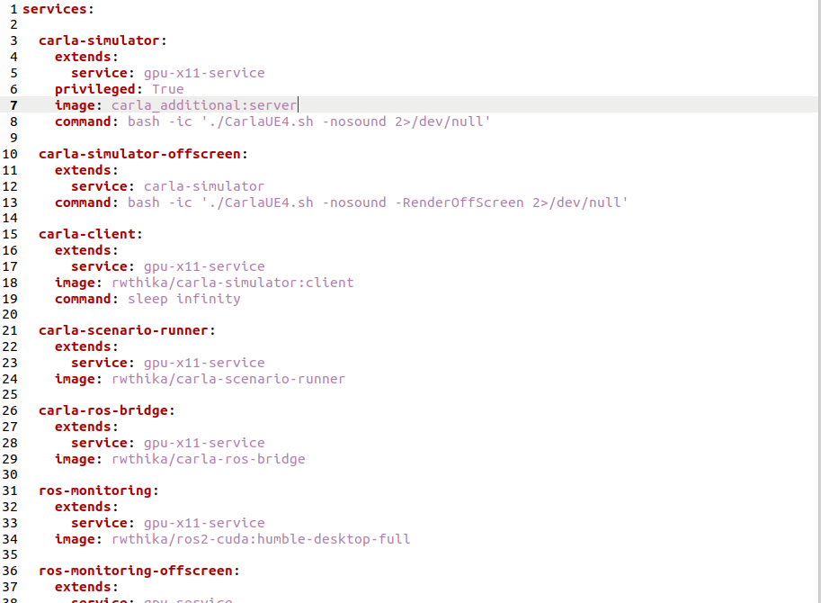
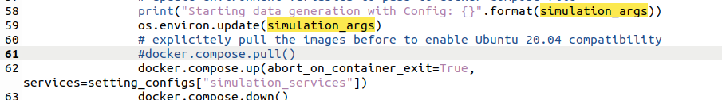
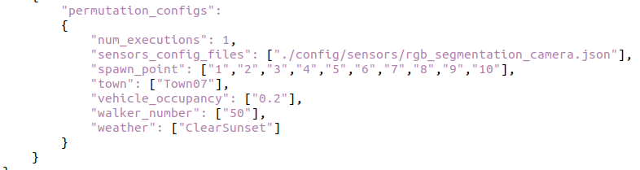

## How to add the extra maps into carlos

Town06 (highway) and Town07 (rural) are additional content which does not come with the standard CARLA package. So to generate dataset through carlos, some preparation is required


##### Step 1. Start the container

`./run-demo.sh software-prototyping `

##### Step 2. Check the container running, find out the container id of the container rwthika/carla-simulator:server

`docker ps -a`

##### Step 3. Get inside the docker container, here the "c3e6497dcd33" is the container id from  Step 2

`docker exec -it c3e6497dcd33 /bin/bash` 

##### Step 4. Download the additional maps and install them

```
carla@c3e6497dcd33:~$ cd Import
carla@c3e6497dcd33:~/Import$ wget https://carla-releases.s3.us-east-005.backblazeb2.com/Linux/AdditionalMaps_0.9.15.tar.gz
carla@c3e6497dcd33:~/Import$ cd
carla@c3e6497dcd33:~$ ./ImportAssets.sh
```
##### Step 5. Commit the running container as a new image

`docker commit c3e6497dcd33  carla_additional:server`

##### Step 6. Change the components.yml in the directory carlos/utils.Change the image name with the name of the image you just saved in Step 5



##### Step 7. Comment the 61st line of the data_generation.py



##### Step 8. Then you can modify the json and generate the data as normal

